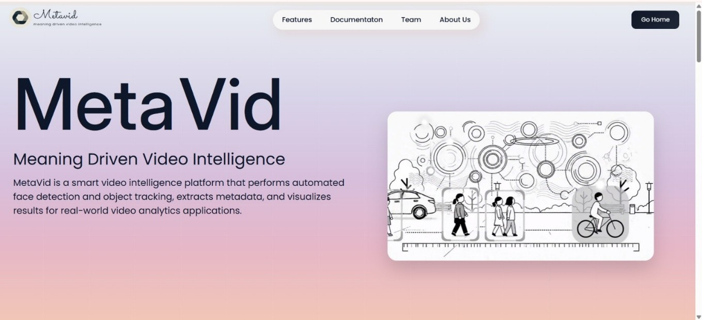
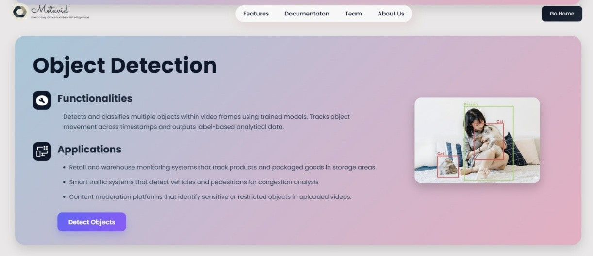
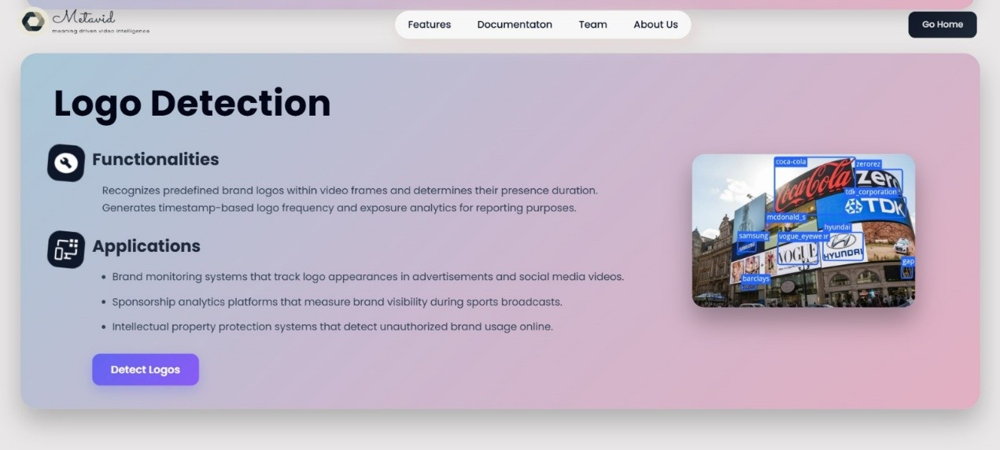
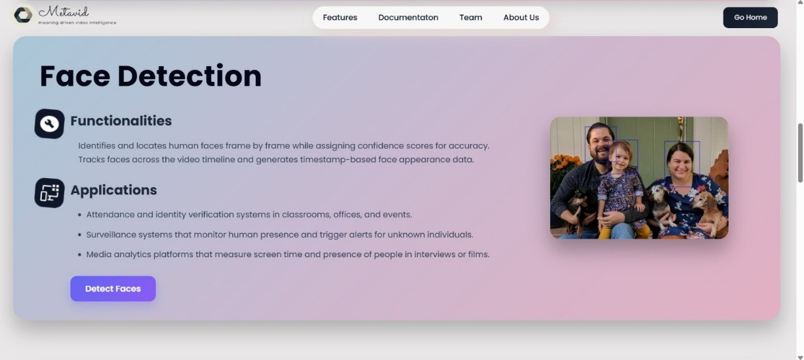
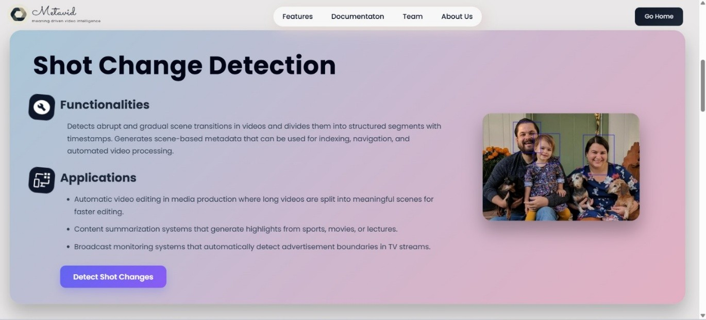
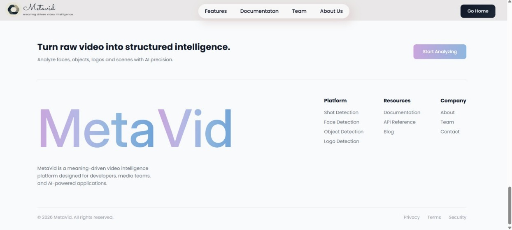
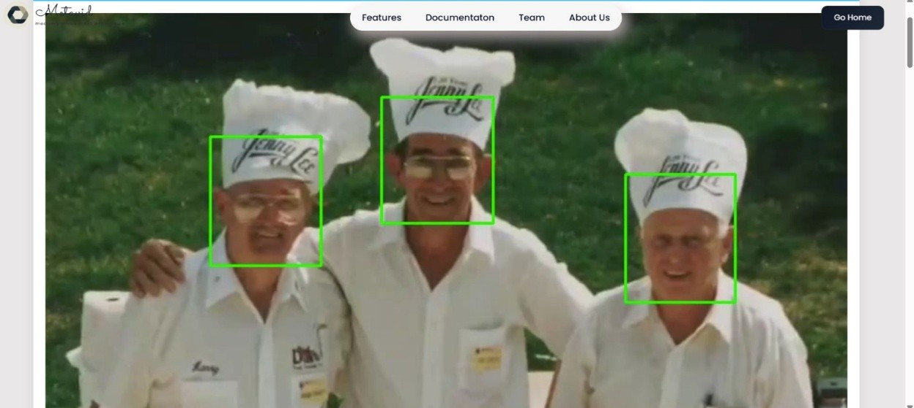
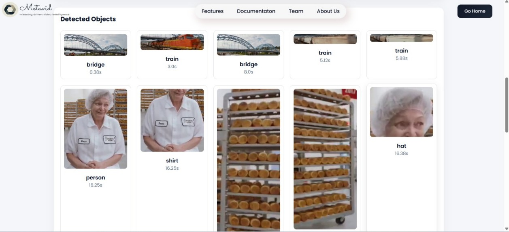
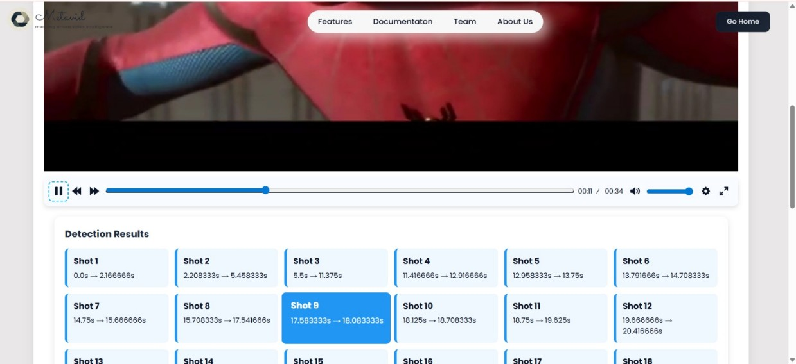

[README .md](https://github.com/user-attachments/files/29534053/README.md)
# 🎬 MetaVid

### Intelligent Video Analysis Platform

**Python • Flask • OpenCV • Google Cloud Video Intelligence API • Cloudinary**

<p>
  
  
  
  
  
</p>

<p>
  
  
  
</p>

Transform raw video content into structured, actionable intelligence using AI-powered computer vision and cloud technologies.

---

## 📑 Table of Contents

- [Overview](#-overview)
- [Features](#-features)
- [Tech Stack](#️-tech-stack)
- [System Workflow](#️-system-workflow)
- [Workflow Explanation](#-workflow-explanation)
- [Screenshots](#-screenshots)
- [Applications](#-applications)
- [Key Highlights](#-key-highlights)
- [Challenges Faced](#️-challenges-faced)
- [Future Enhancements](#-future-enhancements)
- [Installation](#-installation)
- [Project Structure](#-project-structure)
- [Author](#-author)

---

## 📌 Overview

MetaVid is an AI-powered video analysis platform that automatically extracts meaningful insights from uploaded videos. It leverages **Google Cloud Video Intelligence API**, **OpenCV**, and **Cloudinary** to detect important visual elements and events within a video.

The platform analyzes uploaded videos, annotates detected objects with bounding boxes and labels, and delivers the processed video through Cloudinary, allowing users to view AI-generated insights directly in an interactive web dashboard.

---

## ✨ Features

### 🎞️ Shot Change Detection
Detects scene transitions and shot boundaries, helping users understand the structure of a video.

### 👤 Face Detection
Identifies human faces appearing throughout the video.

### 🏷️ Logo Detection
Recognizes brand logos for sponsorship tracking, marketing analysis, and brand monitoring.

### 📦 Object Detection
Detects and classifies objects appearing in the video to improve content understanding.

### ☁️ Cloud-Based Delivery
Uploads the annotated video to Cloudinary and delivers it through a secure public URL for seamless viewing.

---

## 🛠️ Tech Stack

| Layer | Technology |
|--------|------------|
| Backend | Python, Flask |
| Computer Vision | OpenCV |
| AI Video Analysis | Google Cloud Video Intelligence API |
| Cloud Storage & Delivery | Cloudinary |
| Frontend | HTML5, CSS3, JavaScript |

---

## ⚙️ System Workflow

```text
User Uploads Video
       │
       ▼
┌────────────────────────┐
│     Flask Backend      │
└───────────┬────────────┘
            │
            ▼
┌────────────────────────┐
│ Local Storage          │
│ (Temporary Upload)     │
└───────────┬────────────┘
            │
            ▼
┌────────────────────────────────────┐
│ Google Cloud Video Intelligence API│
│ AI Video Analysis                  │
└───────────┬────────────────────────┘
            │
            ▼
┌────────────────────────┐
│ OpenCV                 │
│ Frame Annotation       │
│ (Bounding Boxes)       │
└───────────┬────────────┘
            │
            ▼
┌────────────────────────┐
│ Annotated Video        │
│ Saved Locally          │
└───────────┬────────────┘
            │
            ▼
┌────────────────────────┐
│ Cloudinary             │
│ Upload & Public URL    │
└───────────┬────────────┘
            │
            ▼
┌────────────────────────┐
│ Interactive Dashboard  │
│ Render Results         │
└────────────────────────┘
```

---

## 🔄 Workflow Explanation

- **Upload** — The user uploads a video through the web interface.
- **Store Locally** — Flask temporarily saves the uploaded video for processing.
- **Analyze** — Google Cloud Video Intelligence API extracts AI annotations such as shot changes, faces, logos, and objects.
- **Annotate** — OpenCV overlays bounding boxes and labels onto detected elements within the video.
- **Save** — The annotated video is generated and stored locally.
- **Upload** — The processed video is uploaded to Cloudinary, which generates a secure public URL.
- **Display** — Flask renders the Cloudinary-hosted annotated video along with the AI analysis results in an interactive dashboard.

---

## 📷 Screenshots

> **Add screenshots here**

### 🏠 Home Page



### ✨ Features











### 🎥 Results






---

## 💡 Applications

| Domain | Use Case |
|---------|----------|
| 📺 Media & Broadcasting | Video content monitoring |
| 📣 Marketing | Brand visibility and sponsorship tracking |
| 📚 Education | Educational video indexing and analysis |
| 🗂️ Content Management | Automated video tagging and categorization |
| 🔬 Research | Computer vision and AI experimentation |
| 📊 Digital Marketing | Campaign performance analysis |

---

## 🏆 Key Highlights

- AI-powered video analysis platform
- Automated shot change detection
- Face detection
- Logo recognition
- Object detection
- Frame annotation using OpenCV
- Cloud-hosted annotated video delivery
- Interactive Flask dashboard
- Integration of multiple cloud services
- End-to-end automated video processing workflow

---

## ⚠️ Challenges Faced

- Selecting the appropriate cloud service for large-scale video analysis.
- Designing an efficient processing pipeline for uploaded videos.
- Synchronizing Google Cloud annotations with OpenCV frame rendering.
- Integrating Cloudinary for efficient delivery of processed videos.
- Maintaining smooth performance while processing large video files.

---

## 🚀 Future Enhancements

- 📝 AI-powered video summarization
- 😊 Emotion detection
- 🎙️ Speech-to-text transcription
- 🔑 Keyword extraction
- 🌐 Multi-language support
- ⚡ Real-time video analytics
- 📊 Advanced reporting dashboard
- 🤖 Generative AI-based video insights

---

## 🚀 Installation

```bash
# Clone repository
git clone https://github.com/yourusername/MetaVid.git

# Navigate into project
cd MetaVid

# Create virtual environment
python -m venv venv

# Activate virtual environment

# Windows
venv\Scripts\activate

# macOS/Linux
source venv/bin/activate

# Install dependencies
pip install -r requirements.txt

# Run application
python app.py
```

---

## 📁 Project Structure

```text
MetaVid/
│
├── app.py
├── uploads/
├── annotated_videos/
├── static/
├── templates/
├── requirements.txt
├── README.md
└── ...
```

---

## 👨‍💻 Author

Developed as a computer vision and AI-powered video intelligence project focused on transforming raw video content into meaningful insights using modern cloud technologies.

---

## ⭐ If you found this project useful, consider giving it a star!

Made with ❤️ using **Python • Flask • OpenCV • Google Cloud Video Intelligence API • Cloudinary**
